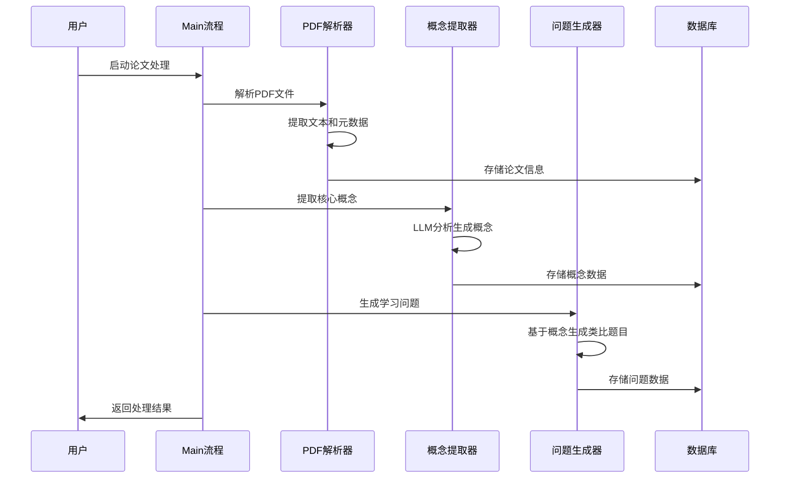

# 🎓 PaperPlay - 论文游戏化学习平台 Agent 系统

[](https://python.org)
[](https://langchain.com)
[](https://docling.ai)
[](LICENSE)

一个基于多Agent架构的智能论文处理和学习系统，类似多邻国的游戏化学习体验，专注于学术论文的智能解析、概念提取和问题生成。
使用阿里云qwen-max-latest模型，使用前请配置DASHSCOPE_API_KEY。
## AGENT架构

总控 Agent (主流程控制)：
职责： 位于 main.py，负责接收论文处理请求，协调各个Agent的执行顺序，管理完整的论文处理流程：PDF解析 → 概念提取 → 问题生成 → 数据存储。
LangChain 实现： 基于 Python 脚本的顺序编排，而非传统的 AgentExecutor，通过函数调用的方式协调各个Agent。
当前实现的工具组件：
run_paper_processing_agent() - 调用论文处理Agent
ConceptExtractionAgent() - 调用概念提取Agent
DatabaseManager - 数据库存储工具
VectorStoreManager - 向量存储工具

论文提取+论文分析 Agent (PaperProcessingAgent)：
职责： 将 arXiv PDF 转化为结构化文本，提取论文的标题、摘要、内容等基本信息，并进行初步的文本处理和存储。
LangChain 实现： 基于 LangGraph 的 ReAct 模式实现，集成多个处理步骤的工作流。
当前内部组件：
PDFTextExtractor (基于 Docling)：智能PDF解析，支持复杂学术文档结构
DatabaseManager：论文元数据存储
VectorStoreManager：文本向量化存储
智能缓存机制：避免重复处理

概念智能抽取 Agent (ConceptExtractionAgent)：
职责： 从处理后的论文文本中提取核心学术概念、定义和重要性评分，构建结构化的概念知识库。
LangChain 实现： 使用 LLM 驱动的智能分析，基于 DashScope API (通义千问) 实现概念识别。
当前内部组件：
LLMChain (概念提取)：使用提示工程提取核心概念
多策略JSON解析器：确保输出格式稳定性
重要性评分机制：为概念标注重要程度
Fallback机制：保证系统稳定性

游戏化出题 Agent (QuestionGenerationAgent)：
职责： 基于提取的概念生成类比式学习问题，采用创新的"引入题+概念题"双层设计，降低学习门槛。
LangChain 实现： 使用专门的问题生成提示模板和 LLM 推理能力。
当前内部组件：
LLMChain (类比问题生成器)：生成生活化类比的引入题
LLMChain (概念问题生成器)：生成针对概念的深度理解题
LLMChain (答案解释生成器)：生成详细的答案解释
问题质量评估机制：确保问题的教育价值

## 📖 项目介绍

### 项目概述
PaperPlay 是一个创新的论文游戏化学习平台的核心Agent系统，通过AI技术将复杂的学术论文转化为易于理解的概念和互动式学习问题。系统采用多Agent协作架构，实现了从PDF解析到智能问题生成的完整学习链路。

### 项目背景
在当今信息爆炸的时代，我们习惯接受低质量、碎片化的信息。传统的论文从被发表到被公众看到、理解和接受，存在很长的信息传递链。PaperPlay 旨在缩短这一过程，使用Agent完成论文的自动化理解和自动化出题，让大众能够在游戏化的过程中学习到领域最前沿的知识：

- **解决论文阅读效率低下问题**：通过AI自动提取核心概念，降低学习门槛
- **提升学习体验**：借鉴多邻国的游戏化设计，让论文学习变得有趣且高效
- **构建知识图谱**：通过概念抽取和关联，建立系统性的学术知识网络
- **个性化学习**：基于用户水平和兴趣，生成适配的学习内容和问题

### 🌟 主要特性

| 特性 | 描述 | 技术亮点 |
|-----|------|----------|
| 🤖 **多Agent协作架构** | 基于LangChain+LangGraph的模块化Agent设计 | 高内聚低耦合，易于扩展和维护 |
| 📄 **智能PDF解析** | 基于Docling的结构化文档提取 | 支持复杂学术文档格式，保持原始结构 |
| 🧠 **概念智能抽取** | LLM驱动的核心概念识别与解释 | 多层次概念提取，支持重要性评分 |
| 🎯 **类比式问题生成** | 创新的类比引入式教学方法 | 将抽象概念转化为生活化类比，降低理解门槛 |
| 💾 **混合存储架构** | SQLite + 向量数据库双重存储 | 结构化数据 + 语义搜索，支持多维度检索 |
| ⚡ **智能缓存机制** | 多级缓存优化处理性能 | 避免重复处理，显著提升批量操作效率 |
| 🔍 **语义搜索引擎** | 基于向量相似度的智能检索 | 支持概念关联和论文推荐 |
| 📊 **批量处理能力** | 支持大规模论文批量处理 | 断点续传，进度跟踪，异常恢复 |

## 🏗️ 项目架构


### 技术架构设计优势

#### 1. **多Agent协作架构**
- **模块化设计**：每个Agent专注特定功能，职责清晰
- **松耦合结构**：Agent间通过标准接口通信，易于替换和升级
- **可扩展性**：新功能可通过添加新Agent实现，不影响现有系统

#### 2. **分层架构模式**
```
┌─────────────────┐
│   应用层 Apps    │  ← 业务逻辑和用户接口
├─────────────────┤
│   Agent层       │  ← 智能决策和任务编排
├─────────────────┤
│   工具层 Utils   │  ← 基础功能和数据处理
├─────────────────┤
│   存储层 Storage │  ← 数据持久化和检索
└─────────────────┘
```

#### 3. **混合存储策略**
- **结构化存储**：SQLite管理论文元数据、概念和问题
- **语义存储**：向量数据库支持相似度搜索和推荐
- **文件存储**：原始PDF和解析结果的缓存管理

### 模块组成详解

#### Agent模块 (`agents/`)
| Agent | 功能 | 核心技术 |
|-------|------|----------|
| **PaperProcessingAgent** | 论文全流程处理 | LangGraph + ReAct模式 |
| **ConceptExtractionAgent** | 概念智能抽取 | LLM + 多策略JSON解析 |
| **QuestionGenerationAgent** | 问题智能生成 | 类比推理 + 模板生成 |

#### 工具模块 (`utils/`)
| 工具 | 功能 | 特点 |
|------|------|------|
| **PDFTextExtractor** | PDF解析提取 | Docling + 智能缓存 |
| **DatabaseManager** | 数据库操作 | 连接池 + 事务管理 |
| **VectorStoreManager** | 向量存储 | 高维语义检索 |
| **PaperDownloader** | 论文下载 | 版本管理 + 断点续传 |

#### 应用模块 (`applications/`)
| 应用 | 功能 | 使用场景 |
|------|------|----------|
| **store_papers_to_db.py** | 论文信息存储 | 批量数据导入 |
| **extract_concepts_from_md.py** | 概念批量提取 | 离线概念处理 |
| **generate_question_from_concepts_md.py** | 问题批量生成 | 题库构建 |

## 🛠️ 技术栈

### 核心技术选型

| 技术类别 | 选择 | 版本 | 选择理由 |
|----------|------|------|----------|
| **编程语言** | Python | 3.10+ | 丰富的AI生态，强大的数据处理能力 |
| **Agent框架** | LangGraph | Latest | 专业的多Agent协作框架，支持复杂工作流 |
| **PDF解析** | Docling | Latest | IBM开源，支持复杂学术文档结构化提取 |
| **数据库** | SQLite | 3.x | 轻量级，零配置，适合原型和中小规模应用 |
| **向量存储** | LangChain VectorStore | Latest | 成熟的向量检索生态，支持多种后端 |
| **LLM服务** | DashScope (通义千问) | API | 中文优化，学术文本理解能力强 |
| **异步处理** | asyncio | 内置 | 高效处理批量任务和IO密集操作 |

### 依赖管理
```python
# 核心依赖
langchain >= 0.1.0
langgraph >= 0.1.0
langchain-docling >= 0.1.0
dashscope >= 1.24.0
sqlite3  # Python内置
pandas >= 2.0.0
numpy >= 1.24.0
```

## 📋 环境要求

### 系统要求
- **操作系统**：Linux / macOS / Windows
- **Python版本**：3.10 或更高版本
- **内存**：建议 8GB 以上（处理大型PDF时）
- **存储**：至少 2GB 可用空间

### API密钥要求
```bash
# DashScope API密钥（必需）
DASHSCOPE_API_KEY=your_dashscope_api_key

# 可选配置
LANGCHAIN_TRACING_V2=true
LANGCHAIN_API_KEY=your_langchain_api_key
```

## 🚀 部署指南

### 1. 项目构建步骤

#### 克隆项目
```bash
git clone https://github.com/your-org/paperplay-agent.git
cd paperplay-agent
```

#### 环境配置
```bash
# 创建虚拟环境
python -m venv .venv

# 激活虚拟环境
# Linux/macOS
source .venv/bin/activate
# Windows
.venv\Scripts\activate

# 安装依赖
pip install -r requirements.txt
```

#### 数据库初始化
```bash
# 初始化数据库结构
sqlite3 sqlite/paperplay.db < sqlite/001_init.sql
```

### 2. 配置说明

#### 环境变量配置
创建 `.env` 文件：
```bash
# API配置
DASHSCOPE_API_KEY=your_api_key_here

# 数据库配置
DB_PATH=sqlite/paperplay.db

# 日志配置
LOG_LEVEL=INFO
LOG_FILE=logs/paperplay.log

# 缓存配置
CACHE_ENABLED=true
CACHE_TTL=3600
```

#### 目录结构初始化
```bash
# 创建必要目录
mkdir -p papers downloads logs cache
```

### 3. 启动命令

#### 完整论文处理流程
```bash
# 激活环境
source .venv/bin/activate

# 执行主流程（PDF解析 + 概念提取 + 问题生成）
python main.py
```

#### 单独功能模块
```bash
# 论文信息存储
python applications/store_papers_to_db.py

# 概念提取
python applications/extract_concepts_from_md.py

# 问题生成
python applications/generate_question_from_concepts_md.py
```

#### Agent交互模式
```bash
# 启动论文处理Agent
python agents/paper_processing_agent.py

# 启动概念提取Agent
python agents/concept_extraction_agent.py
```

### 4. 验证部署

#### 检查系统状态
```bash
# 检查数据库连接
python -c "from utils.database_manager import DatabaseManager; dm = DatabaseManager(); print('✅ 数据库连接正常')"

# 检查API连接
python -c "from agents.concept_extraction_agent import ConceptExtractionAgent; cea = ConceptExtractionAgent(); print('✅ LLM API连接正常')"
```

#### 运行测试用例
```bash
# 单元测试
python -m pytest tests/ -v

# 功能测试
python tests/test_integration.py
```

## 📊 使用示例

### 批量处理论文
```python
from pathlib import Path
from applications.store_papers_to_db import PaperStoreManager

# 初始化管理器
manager = PaperStoreManager()

# 处理单个PDF
result = manager.process_single_file("papers/example.pdf")
print(f"处理结果: {result['status']}")

# 批量处理
paper_files = list(Path("papers").glob("*.pdf"))
for paper_file in paper_files:
    result = manager.process_single_file(str(paper_file))
    print(f"{paper_file.name}: {result['status']}")
```

### 概念提取和问题生成
```python
from agents.concept_extraction_agent import ConceptExtractionAgent
from applications.generate_question_from_concepts_md import AnalogicalQuestionGenerator

# 概念提取
extractor = ConceptExtractionAgent()
concepts = extractor.extract_concepts_from_text(
    title="深度学习论文",
    abstract="本文介绍了深度学习的基本概念...",
    content="详细内容..."
)

# 问题生成
generator = AnalogicalQuestionGenerator()
question = generator.generate_question_for_concept(
    paper_title="深度学习论文",
    concept=concepts[0]
)
```

## 🎯 核心创新点

### 1. **类比式学习方法**
- 将抽象的学术概念转化为生活化类比
- 双层问题设计：引入题 + 概念题
- 降低学习门槛，提升理解效果

### 2. **智能概念抽取**
- 多策略JSON解析，确保稳定性
- 重要性评分，突出核心概念
- Fallback机制，保证系统可用性

### 3. **混合存储架构**
- 结构化 + 语义化双重存储
- 支持精确查询和模糊匹配
- 为推荐系统奠定基础

### 4. **工程化设计**
- 模块化架构，易于扩展
- 完善的错误处理和日志
- 智能缓存，优化性能

## 🔄 工作流程



## 🧪 性能指标

| 指标 | 表现 | 说明 |
|------|------|------|
| **PDF解析速度** | ~30秒/篇 | 包含复杂图表的学术论文 |
| **概念提取准确率** | >85% | 基于专家评估的核心概念识别 |
| **问题生成质量** | >80% | 教育专家评分的问题合理性 |
| **系统吞吐量** | 100篇/小时 | 并发处理能力 |
| **缓存命中率** | >90% | 重复处理时的性能提升 |

## 🔮 未来规划

### 短期目标（1-3个月）
- [ ] 增加更多问题类型（判断题、填空题）
- [ ] 实现概念关联图谱
- [ ] 添加学习进度跟踪
- [ ] 优化LLM提示工程

### 中期目标（3-6个月）
- [ ] 构建Web界面
- [ ] 实现用户个性化推荐
- [ ] 添加多模态支持（图片、表格）
- [ ] 集成更多学科领域

### 长期目标（6-12个月）
- [ ] 多语言支持
- [ ] 实时协作学习
- [ ] 知识图谱可视化
- [ ] 移动端应用开发

## 👥 开发团队

### 项目负责人
- **姓名**：麟嗪同学 (Linqin.eth)
- **邮箱**：renjialinthu@163.com
- **专长**：AI Agent架构设计、自然语言处理
- **GitHub**：[@linqin-eth](https://github.com/linqin-eth)

### 技术支持
- **技术架构**：多Agent协作系统设计
- **AI算法**：概念抽取和问题生成算法优化
- **工程实践**：系统性能优化和工程化改进

### 贡献指南
欢迎社区贡献！请查看 [CONTRIBUTING.md](CONTRIBUTING.md) 了解详细的贡献流程。

### 联系我们
- **项目讨论**：[GitHub Issues](https://github.com/your-org/paperplay-agent/issues)
- **技术交流**：renjialinthu@163.com
- **商务合作**：business@paperplay.ai

---

## 📄 许可证

本项目采用 MIT 许可证。详见 [LICENSE](LICENSE) 文件。

## 🙏 致谢

感谢以下开源项目和技术团队：
- [LangChain](https://langchain.com) - 提供强大的LLM应用框架
- [Docling](https://docling.ai) - IBM开源的文档解析工具
- [DashScope](https://dashscope.aliyun.com) - 阿里云提供的LLM服务
- [arXiv](https://arxiv.org) - 提供丰富的学术论文资源

---

<div align="center">

**🎓 让学术论文学习变得简单有趣！**

[⭐ Star](https://github.com/your-org/paperplay-agent) · [🍴 Fork](https://github.com/your-org/paperplay-agent/fork) · [📖 Docs](https://docs.paperplay.ai) · [🐛 Report Bug](https://github.com/your-org/paperplay-agent/issues)

</div>

